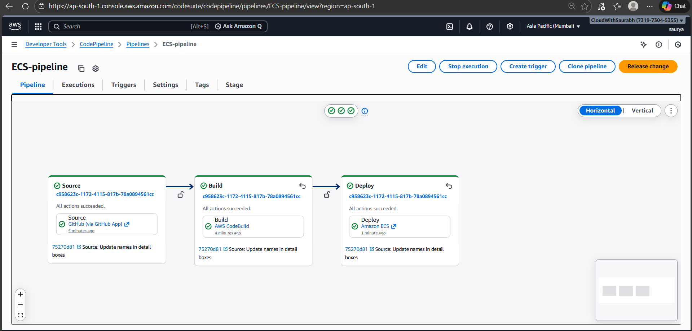

# 🚀 End-to-End CI/CD Deployment using AWS ECS Fargate

## 📌 Project Overview

This project demonstrates a complete production-style CI/CD pipeline for deploying a Dockerized web application on AWS using a serverless container architecture.

The application is:

- Containerized using Docker
- Stored in Amazon ECR
- Deployed on Amazon ECS (Fargate)
- Exposed using Application Load Balancer
- Automatically built & deployed using AWS CodePipeline and CodeBuild
- Triggered automatically via Webhook on `master` branch

This project implements DevOps best practices including automation, rolling updates, scalability, and high availability.

---

# 🏗️ Architecture Flow

GitHub (master branch)  
⬇ Webhook Trigger  
AWS CodePipeline  
⬇  
AWS CodeBuild (Docker Build & Push)  
⬇  
Amazon ECR (Image Registry)  
⬇  
Amazon ECS Fargate  
⬇  
Application Load Balancer  
⬇  
End Users  

---

# 🖼️ Architecture Diagram

<p align="center">
  
</p>

---

# 🛠️ Technologies Used

- Amazon EC2
- Docker
- Amazon ECR
- Amazon ECS (Fargate Launch Type)
- Application Load Balancer
- AWS CodeBuild
- AWS CodePipeline
- Amazon S3 (Artifact Storage)
- IAM Roles & Policies
- GitHub (Source Repository)

---

# 🔹 Implementation Steps

---

## 1️⃣ Launch EC2 & Install Docker

```bash
sudo yum update -y
sudo yum install docker -y
sudo service docker start
sudo usermod -aG docker ec2-user
```

Logout and login again.

Verify Docker:

```bash
docker -v
```

---

## 2️⃣ Clone Repository & Build Image

```bash
git clone https://github.com/<your-username>/<your-repo>.git
cd <your-repo>
docker build -t website:latest .
```

Test locally:

```bash
docker run -itd -p 80:80 website
```

Verify:

```
http://<EC2-Public-IP>
```

---

## 3️⃣ Create Amazon ECR Repository

Create repository in ECR:

```
aws-ers-ecs-project
```

Attach IAM policy to EC2 instance:

```
AmazonEC2ContainerRegistryFullAccess
```

---

## 4️⃣ Push Docker Image to ECR

Login:

```bash
aws ecr get-login-password --region ap-south-1 | docker login --username AWS --password-stdin <account-id>.dkr.ecr.ap-south-1.amazonaws.com
```

Tag image:

```bash
docker tag website:latest <account-id>.dkr.ecr.ap-south-1.amazonaws.com/aws-ers-ecs-project:latest
```

Push image:

```bash
docker push <account-id>.dkr.ecr.ap-south-1.amazonaws.com/aws-ers-ecs-project:latest
```

Verify:

```bash
aws ecr list-images \
--region ap-south-1 \
--repository-name aws-ers-ecs-project
```

---

## 5️⃣ Create ECS Cluster (Fargate)

- Launch type: Fargate
- Platform version: Latest
- No EC2 management required

---

## 6️⃣ Create Task Definition

Configuration:

- Launch type: Fargate
- CPU & Memory defined
- Execution role attached
- Container image: ECR URI
- Port mapping: 80
- CloudWatch logging enabled

---

## 7️⃣ Create ECS Service

Configuration:

- Launch type: Fargate
- Desired tasks: 4
- Deployment strategy: Rolling Update
- Public IP: Enabled

### Load Balancer Setup

- Application Load Balancer
- Listener: HTTP (80)
- Target group health check path: `/`

Application accessible via:

```
http://<load-balancer-dns>
```

---

## 8️⃣ Create Private S3 Bucket

Used by CodePipeline for storing build artifacts.

---

## 9️⃣ Setup AWS CodeBuild

- Source: GitHub
- Branch: `master`
- Privileged mode enabled (required for Docker)
- Uses `buildspec.yml` present in repository

Responsibilities:

- Build Docker image
- Tag image
- Push to ECR

---

## 🔟 Setup AWS CodePipeline (Webhook Enabled)

Pipeline Stages:

1. Source (GitHub - master branch)
2. Build (CodeBuild)
3. Deploy (ECS Service)

Webhook is configured to automatically trigger the pipeline whenever changes are pushed to the `master` branch.

---

# 🔄 CI/CD Pipeline Execution

Whenever changes are pushed:

```bash
git add .
git commit -m "update"
git push origin master
```

Pipeline automatically:

- Detects change via webhook
- Builds new Docker image
- Pushes to ECR
- Updates ECS service
- Performs rolling deployment
- Replaces old containers without downtime

---

# 📸 Successful Pipeline Execution

<p align="center">
  
</p>

---

# 📂 Project Structure

```
.
├── Dockerfile
├── Application Source Code
├── buildspec.yml
├── images/
│   ├── architecture.png
│   └── pipeline-success.png
└── README.md
```

---

# ⚙️ Key Features

✔ Fully automated CI/CD pipeline  
✔ Docker containerization  
✔ Serverless deployment using Fargate  
✔ Load-balanced scalable architecture  
✔ Rolling updates (Zero downtime)  
✔ Webhook-based automatic trigger  
✔ Secure artifact storage  

---

# 📈 DevOps Concepts Demonstrated

- Continuous Integration & Deployment
- Containerization
- Infrastructure Automation
- IAM Role-based Access Control
- Load Balancing & High Availability
- Scalable Serverless Architecture

---

# 🎯 Final Outcome

A highly available, scalable, auto-deployed web application running on AWS using ECS Fargate with complete CI/CD automation.

---

# 👨‍💻 Author

CloudWithSaurabh  
DevOps Engineer | AWS | Docker | CI/CD
